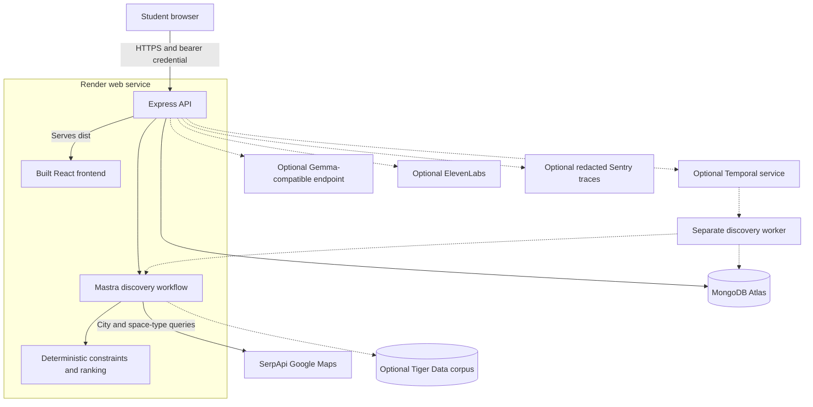
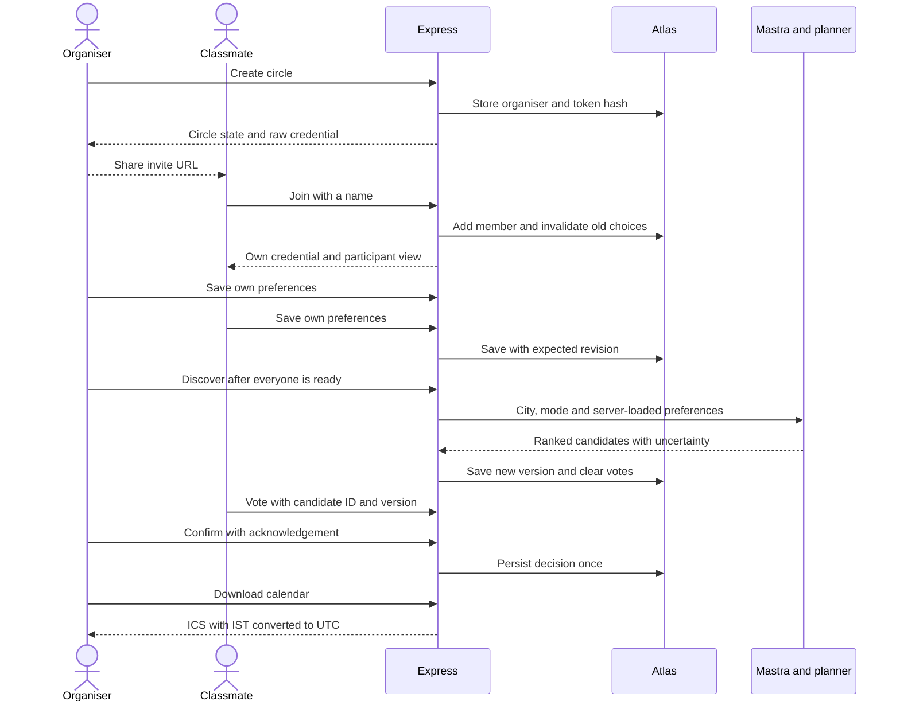
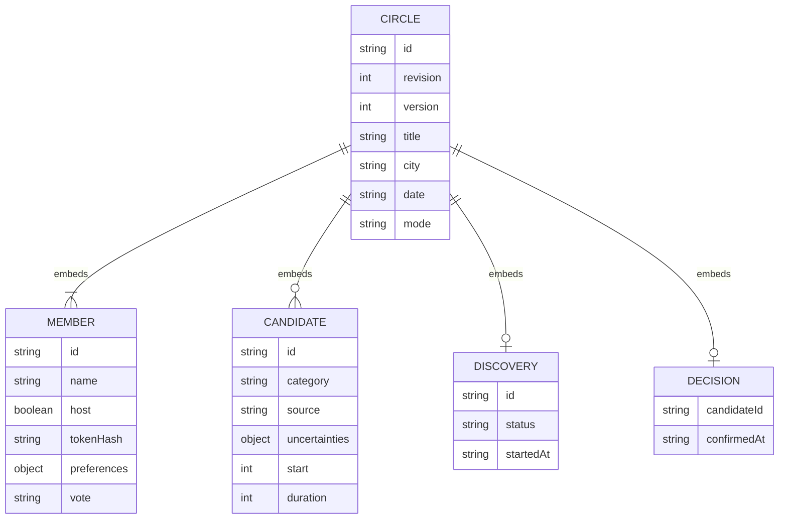
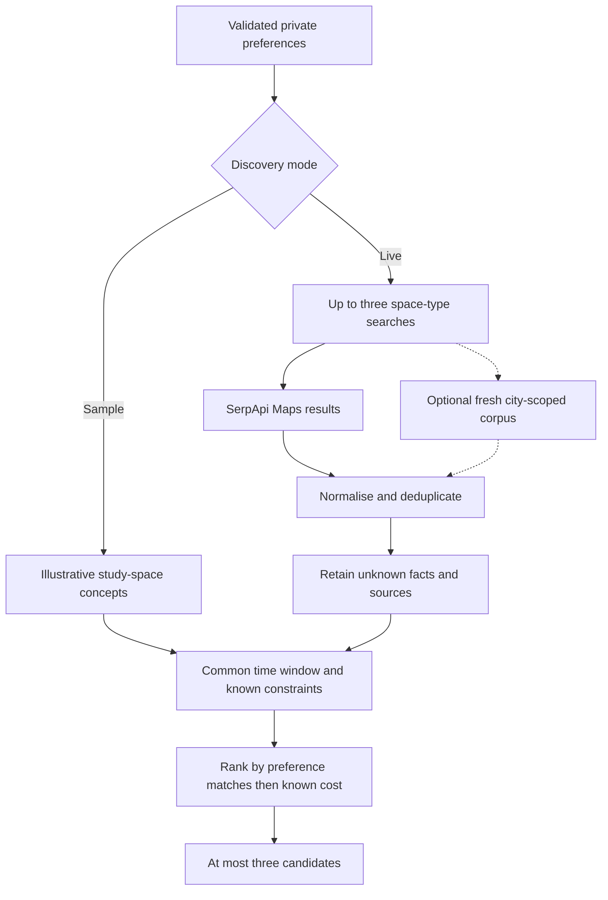
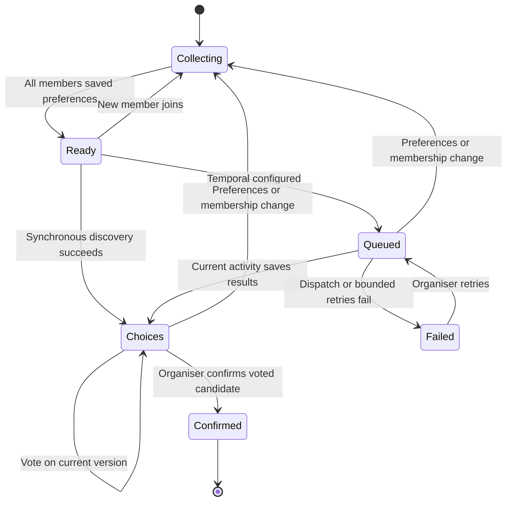
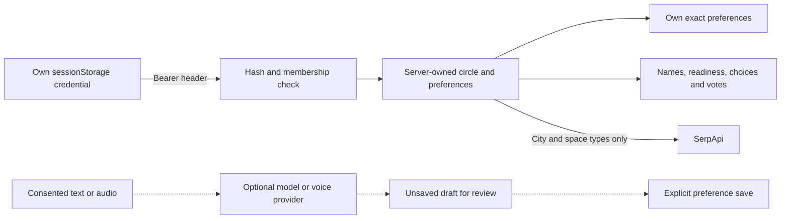

# SideQuest architecture

SideQuest coordinates **college study circles**: private student constraints become a shared shortlist and a confirmed study session. The live path is React + Express on Render, MongoDB Atlas and SerpApi discovery through Mastra. Dashed connections below are optional; they do not imply hosted execution.

## Components and deployment

`server/index.mjs` opens the store and starts Express on `0.0.0.0`. The API serves `dist` and returns the SPA entry for frontend routes. Vite development uses port 5174 and proxies `/api` to port 3100. Render production serves both from one origin.

## A circle from invite to calendar

The organiser starts discovery and confirms the final choice. Confirmation requires a current candidate, current version, acknowledgement and at least one vote. The UI requires the organiser's own pick; the API accepts any candidate with a member vote. No majority/quorum rule or automatic winner is implemented.

## Storage model

This diagram describes embedded objects, not separate relational tables. Atlas stores one document per circle in the `outings` collection. Local SQLite stores the same document as JSON with an indexed ID and revision. The API and collection retain legacy `outings` identifiers; the product is study circles.

Two counters solve different problems:

- `revision`: compare-and-swap saves reject concurrent overwrites. Atlas replaces by ID + expected revision; SQLite updates with the same condition.
- `version`: preferences or membership changes invalidate the candidate set and votes. Vote/confirmation requests include the candidate version.

Production requires Atlas. Development can use `.data/sidequest.db`; explicit production preview uses in-memory SQLite and disables live discovery. There is no silent fallback to SQLite if configured Atlas fails.

## Discovery and constraint handling

The common window starts at the latest student start and ends at the earliest end. Known costs must fit every budget; known false quietness/access values reject a requirement. Null live values are retained with warnings, so passing a filter is not proof of suitability.

Live queries use city and selected space types. At most three categories are searched in parallel, with up to five results from each and a 15-second request timeout. Names/addresses are bounded; results have Maps sources and retrieval timestamps. Live sessions assume 90-minute duration; that is a planning default, not a venue fact.

The optional Tiger Data adapter merges fresh city/category-scoped lexical/vector retrieval with live results, then warms a bounded corpus. Index failure does not discard live results. It needs separate database/embedding setup and has not been verified against a live corpus.

## Planning state and stale work

These are conceptual states; readiness/voting derive from member data, while discovery explicitly stores `queued`, `complete` or `failed`. Empty discovery results produce no shortlist; students must adjust preferences or retry. Synchronous provider failure preserves saved preferences; its result save uses the original revision to reject intervening changes. Durable activities reload state and check job/version before saving with the current revision.

When Temporal is configured, the API persists a job before dispatch and returns 202. Workflow arguments contain only `outingId`, `jobId` and `version`. The activity loads preferences from Atlas, executes Mastra, reloads state and saves only if the job/version remain current. Repeated dispatch uses the same workflow ID; completed activities are idempotent.

Retries are bounded to five attempts and ten minutes, with a 90-second activity timeout. A terminal failure marks the matching job failed. The browser polls every five seconds. Local worker-replacement recovery is verified; the current live app uses synchronous discovery, without a hosted Temporal worker.

## Privacy and optional processing

Other members never receive peer preference objects or token hashes. An invite permits joining but is not a member credential. There is no identity/account system, credential recovery or end-to-end encryption of stored preferences. Shared choices can reveal broad group constraints.

Gemma-compatible interpretation runs through a validated Mastra workflow and returns an unsaved draft. ElevenLabs uploads authenticate before multipart processing, bound audio to 5 MB and require consent. Spoken invitations use the public confirmed plan. These live providers remain unverified; fixtures exercise their contracts.

Sentry defaults to no automatic HTTP instrumentation. Explicit spans pass through an allowlist that omits prompts, request URLs, credentials and user fields. Cloud receipt still needs a DSN and verification. Tinker, Backboard and TabPFN are separate evaluation tools, not part of the current decision path. Entire hooks are local development tooling, not an application runtime component.

## Code map and limits

| Module | Responsibility |
| --- | --- |
| `src/main.tsx` | Routes, session storage, preferences, polling, voting and calendar UI |
| `server/app.mjs` | Validation, membership/host checks, versioned mutations and HTTP responses |
| `server/store.mjs` | Atlas/SQLite persistence and optimistic revisions |
| `server/planner.mjs` | Space search, constraints, ranking, model extraction and ICS |
| `server/workflows.mjs` | Mastra discovery and interpretation pipelines |
| `server/durable.mjs`, `server/worker.mjs` | Optional queue dispatch and activities |
| `server/venue-index.mjs` | Optional hybrid corpus |
| `server/voice.mjs`, `server/telemetry.mjs` | Optional consented audio and redacted traces |

The API has bounded JSON/audio inputs and a process-local request limiter; it is not a distributed quota system. Circles hold at most eight members. No room reservations, university directory, syllabus/notes repository, real attendance model or automatic calendar synchronisation exists. Archived hardware observation code remains but is excluded from active study-circle scope.

See [TESTING.md](TESTING.md) for reproducible checks and [SPONSORS.md](SPONSORS.md) for executed versus pending integrations.
