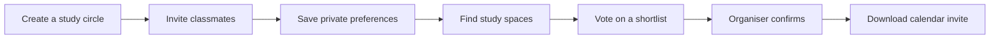

# SideQuest

**Study circles for school and college students, with private preferences and one shared plan.**

SideQuest helps classmates turn "we should revise together" into a time and place. Students share availability, study-space budgets and requirements privately, vote on a shortlist and confirm a session with a calendar invitation.

[Live app](https://sidequest-lzrz.onrender.com) | [Architecture](ARCHITECTURE.md) | [Testing](TESTING.md) | [Sponsor evidence](SPONSORS.md)

## How a circle works



1. Name the session, such as **Data structures revision**, and choose a city/date.
2. Share the invite link. Each student joins with a separate participant session.
3. Save a budget in INR, availability, preferred space types, quietness and step-free requirements.
4. The organiser finds options once everyone has saved preferences.
5. Students vote; the organiser acknowledges unresolved details and confirms an option.
6. Download an ICS invitation. Times currently use **Asia/Kolkata**.

Changing preferences or membership clears earlier options and votes. Confirmation locks further planning changes.

## Say it the way you'd text it

Students can type their preferences the way they'd message the group (*"kal shaam 5 se 8 free hu, 200 se zyada nahi, library ya cafe, lift chahiye"*) or upload a voice note. ElevenLabs Scribe transcribes the note. A fine-tuned open model turns the text into a draft that fills the same private controls. Nothing is saved until the student reviews it.

The model is **Qwen3.5-4B with a LoRA adapter trained on Tinker**, served live through Tinker's OpenAI-compatible endpoint. On 50 hand-written held-out messages (English, Hinglish, typos, prompt-injection attempts):

| Model | Exact on all six fields |
| --- | --- |
| Qwen3.5-4B, zero-shot | 34 / 50 |
| Qwen3.5-4B, three examples in the prompt | 35 / 50 |
| Qwen3.6-27B, zero-shot | 50 / 50 |
| **Qwen3.5-4B, fine-tuned on Tinker** | **50 / 50** |

On 100 unseen generated messages the tuned model scores 99, against 58 zero-shot and 91 for the 27B model. Training used 800 synthetic messages; no participant data. The prompt lives in [server/extraction-prompt.txt](server/extraction-prompt.txt) and is shared by the trainer and the server, so serving matches training token for token. See [scripts/tinker_study.py](scripts/tinker_study.py) and [evaluations/tinker-study.json](evaluations/tinker-study.json).

## Try it

**Explore a sample circle** opens a fictional revision group with illustrative library, campus and study-cafe concepts. It works without search or model credentials.

**Live study spaces** searches SerpApi Google Maps for libraries, campus study rooms, study cafes, coworking spaces and outdoor study spots. Cards include Maps links; API data includes retrieval timestamps. Hosted live mode requires `SERPAPI_API_KEY` and persistent storage.

Live prices, hours, noise, campus visitor eligibility, travel time and group-discussion suitability are unverified. Unknown facts remain unknown; a shortlist is not a booking or a guarantee of access.

## Current release

| Area | Executed evidence |
| --- | --- |
| Render | Public React frontend and Express API deployed together |
| MongoDB Atlas | Real writes/read-back, participant isolation and persistence across redeployment |
| SerpApi + Mastra | Real public library discovery through the discovery workflow |
| Core correctness | 18 automated tests, build and Actions passed for the study-circle release |
| Browser | New public homepage/revision shortlist checked; earlier full desktop/mobile flows recorded |
| Temporal | Official local server recovered a persisted retry after worker replacement |
| Tinker | Fine-tuned Qwen3.5-4B serves live preference drafts; 34/50 → 50/50 on hand-written held-out messages |
| ElevenLabs | Live voice-note transcription (Scribe) and spoken invitations, checked on the public service |

[Evaluation reports](evaluations/README.md) record provenance and limits. Prepared adapters do not imply completed connections. Sentry cloud tracing, Tiger Data, Backboard and hosted Temporal remain conditional. Entire is installed locally; capture needs hook trust review and a reviewed session. Hardware is outside active release scope.

## Run locally

Requirements: **Node.js 24+**, npm and Git. Run commands from this repository directory.

```powershell
git clone https://github.com/N-45div/sidequest.git
cd sidequest
npm ci
Copy-Item .env.example .env
npm run build
npm start
```

If `.env` exists, keep it and edit only needed settings. Blank `MONGODB_URI` with `NODE_ENV=development` uses SQLite at `.data/sidequest.db`. Open **http://localhost:3100**.

For frontend development, run these in separate terminals:

```powershell
# Terminal 1: API
npm run server
```

```powershell
# Terminal 2: frontend
npm run dev
```

Open **http://localhost:5174**. Vite forwards API requests to port 3100. `npm start` serves the last built frontend; rebuild after UI changes.

## Configuration

Copy names from [.env.example](.env.example). Put values in ignored `.env` locally and Render secret settings. Server credentials must not appear in frontend code or `VITE_*` variables.

| Settings | Purpose |
| --- | --- |
| `PORT`, `NODE_ENV` | HTTP port/storage guard; local defaults are 3100/development |
| `MONGODB_URI`, `MONGODB_DATABASE` | Atlas storage; database defaults to `sidequest` |
| `SERPAPI_API_KEY` | Live study-space discovery |
| `MODEL_BASE_URL`, `MODEL_NAME`, `MODEL_API_KEY` | OpenAI-compatible completions endpoint and model for consented preference drafts (the tuned `tinker://` sampler path in production) |
| `TEMPORAL_ADDRESS`, `TEMPORAL_NAMESPACE`, `TEMPORAL_API_KEY` | Optional queueing with a separate worker |
| `TIGER_DATABASE_URL`, `EMBEDDING_*` | Optional hybrid venue corpus |
| `ELEVENLABS_API_KEY`, `ELEVENLABS_VOICE_ID` | Optional transcription and confirmed audio invitations |
| `SENTRY_DSN` | Optional explicitly redacted tracing |
| `TINKER_API_KEY`, `BACKBOARD_*` | Separate evaluation scripts |
| `RENDER_API_KEY` | Local deployment helper only; keep out of the web runtime |

Capabilities reflect configuration presence, not provider health. Typed controls/sample discovery work without a model. [Integration instructions](infra/README.md) cover optional services and evaluation prerequisites.

## Deploy on Render

[render.yaml](render.yaml) builds with `npm ci --include=dev && npm run build`, starts with `npm start` and checks `/api/health`. Express listens on `0.0.0.0` using Render's `PORT`.

1. Connect the public repository in Render and use `render.yaml`.
2. Set Atlas URI/database secrets and allow the service's actual outbound addresses in Atlas.
3. Set `SERPAPI_API_KEY` for live discovery. Keep `ALLOW_EPHEMERAL_DEMO=false` for durable hosting.
4. Deploy, inspect health/capabilities and run the public checks in [TESTING.md](TESTING.md).

Production refuses to start without MongoDB unless disposable preview mode is explicit. [render-preview.yaml](render-preview.yaml) uses memory, disables live circles and displays a reset notice. Preview records disappear on restart.

The existing helper targets only the known SideQuest service; these commands need its ignored `artifacts/render-service.json` state:

```powershell
python scripts/render-deploy.py --status
python scripts/render-deploy.py --redeploy
```

`--redeploy` pins current Git HEAD; push that commit first. A new clone has no service-state artifact. Connect your service through the dashboard/blueprint instead of assuming local state is portable. A Temporal worker is a separate deployment; see [infra/README.md](infra/README.md).

## Privacy and decision boundaries

- The invite URL lets someone join and contains no organiser credential. Share only that URL.
- The browser keeps a participant credential in `sessionStorage`; storage holds its SHA-256 hash. The server can read preferences, but peers cannot fetch each other's exact fields.
- Sessions are not accounts. Closing a browser session, clearing storage or switching devices can lose access; recovery is not implemented. Circles have an eight-person limit.
- SerpApi receives city/space-type queries, not identities or budgets. Model/voice processing requires consent and draft review.
- The organiser chooses the final plan. There is no automatic majority decision, attendance prediction, university identity verification or campus booking integration.

## Repository guide

| Path | Contents |
| --- | --- |
| `src/` | React interface and responsive styles |
| `server/` | API, stores, planner, workflows and optional adapters |
| `tests/` | Deterministic API, integration, storage and study-space checks |
| `scripts/` | Public/local browser checks, deployment and evaluations |
| `infra/` | Optional inference, corpus and worker deployment instructions |
| `evaluations/` | Actual executed evidence; no credentials |
| `submission/` | Drafts, walkthrough and remaining release checklist |

## Submission material

[DEV post](submission/DEV_POST_BODY.md) | [SerpApi entry](submission/SERPAPI_DRAFT.md) | [Demo walkthrough](submission/DEMO_WALKTHROUGH.md) | [Remaining work](submission/RELEASE_CHECKLIST.md)

The recipient and sample students are hypothetical; no real-friend feedback is claimed. Hacktoberfest's real-recipient story remains outstanding. The SerpApi entry needs its local demo video and participant details. Neither draft has been published/submitted. SideQuest is independent, with no Parallel source or assets.
