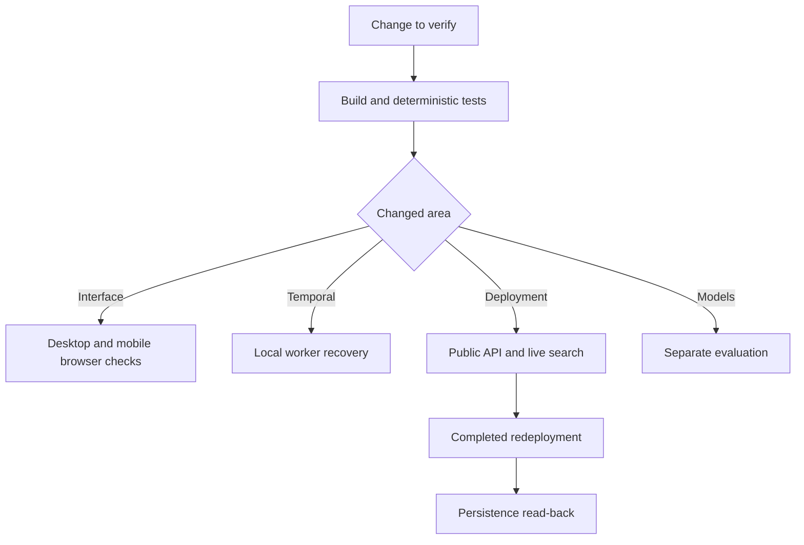

# Testing SideQuest

Run commands from the repository root. The study-circle release passed **18 deterministic tests** and the production build. Provider checks and browser evidence have separate scope.

## Choose a check



## Fast checks: no provider account required

```powershell
npm ci
npm run build
npm test
```

Build runs TypeScript validation and Vite bundling. Tests use Node's runner, isolated in-memory SQLite, simulated providers and injected activities. They do not require a listening app or load `.env` through the test command. Keep optional provider variables out of the test process for deterministic results.

| File | Cases | Coverage |
| --- | --- | --- |
| `tests/api.test.mjs` | 9 | Participant isolation, outsiders, validation, host permissions, stale votes, confirmation, IST calendar, optimistic writes and dispatch failures |
| `tests/integrations.test.mjs` | 6 | Mastra execution, vector validation, telemetry redaction, durable invalidation/idempotency and voice fixtures |
| `tests/preview.test.mjs` | 1 | Production storage refusal and explicit sample-only memory preview |
| `tests/study.test.mjs` | 2 | Free study-space constraints, library query and unresolved campus/access/noise facts |

Focused run: `node --test tests/study.test.mjs`.

[GitHub Actions](.github/workflows/check.yml) runs install/build/tests on `main` pushes and pull requests. CI does not execute browser, paid-provider or cloud persistence checks.

## Local browser checks

Install Google Chrome, build the app and run `npm start` in another terminal on **port 3100**. Sample mode works with development SQLite and no provider keys.

```powershell
node scripts/browser-check.mjs
node scripts/voice-ui-check.mjs
```

| Script | Covers |
| --- | --- |
| `browser-check.mjs` | Sample circle, preference edits, voting, confirmation, ICS, refresh, independent guest, mobile overflow and page errors |
| `voice-ui-check.mjs` | Consent gates, unsaved transcript/draft review and confirmed audio invitation UI |

Screenshots are written into ignored `artifacts/`. Voice responses and audio are fixtures; they do not prove playable ElevenLabs output or live model quality. The full browser suite ran before the study-circle rename; renamed scripts are available, and the new public homepage/shortlist were checked separately. A previous browser run is not a new full run.

Manual release pass: create/join in independent sessions, save different budgets, discover, vote and confirm. Check peer preference privacy. At 390px width, check headings and horizontal overflow. Before confirmation, edit a preference and verify previous options/votes clear.

## Atlas connectivity

Configure the ignored environment with `MONGODB_URI`, `MONGODB_DATABASE=sidequest` and suitable network access:

```powershell
node --env-file=.env scripts/atlas-check.mjs
```

This pings Atlas, inserts a randomly identified `deployment_checks` document, reads it back and deletes that document during cleanup. It is restricted to the `sidequest` database. It checks read/write access, not backups or availability guarantees.

## Public API release check

Use the intended HTTPS service. This creates fictional participants and a confirmed sample plan in its database:

```powershell
node scripts/live-check.mjs https://sidequest-lzrz.onrender.com
```

Assertions cover Atlas storage, preview disabled, create/join, private preferences, outsider rejection, host-only discovery/confirmation, known filters, voting, idempotent confirmation and ICS.

The public report is `evaluations/render-live.json`. Private read-back state is `artifacts/live-check-session.json`, containing a credential: never commit or upload it. Repeating the initial run replaces that artifact and creates another group; earlier groups are not removed.

### Persistence across deployment

Run the initial check first, complete a new deployment and confirm it is **live**, then read back using the same service and private artifact:

```powershell
python scripts/render-deploy.py --status
node scripts/live-check.mjs https://sidequest-lzrz.onrender.com --verify-persistence
```

The second command compares the saved decision exactly. Without an intervening completed deployment, it is not restart-persistence evidence. Inspect report changes before committing them.

## Real SerpApi discovery

The public service needs Atlas and a valid server-side search key:

```powershell
node scripts/serpapi-live-check.mjs https://sidequest-lzrz.onrender.com
```

This creates a fictional organiser, saves library preferences and executes actual Maps discovery through Mastra. It verifies non-sample cards, Maps sources, timestamps and unknown cost/noise/access. `evaluations/serpapi-live.json` excludes credentials. The check consumes provider searches and creates a test group; venue order can change.

Success does not verify campus entry, room availability, hours or group-discussion suitability. Unknown values must not become claims of suitability.

## Temporal recovery

```powershell
npm run check:temporal
```

The script downloads/runs the official local test server, injects failure, stops the first worker and starts a replacement. It checks two attempts, completion, stored candidates and no preference payload in workflow history. Output: `evaluations/temporal-recovery.json`.

Hosted recovery additionally needs a worker, shared Atlas, Temporal credentials and a real queued job interrupted during execution. Enable queueing only after the worker is running; see [infra/README.md](infra/README.md).

## Optional evaluations

| Tool | Command / guide | Prerequisite and limit |
| --- | --- | --- |
| Tinker | `python scripts/tinker_experiment.py --train` in its virtual environment | Real training/sampling usage; six synthetic cases do not establish production quality |
| Backboard | `npm run eval:backboard` | API key/model pairs; existing extraction fixtures |
| TabPFN | `python scripts/tabpfn-eval.py --csv PATH --consented-aggregate-data` | Separate ML environment; 50+ distinct real aggregate records and both outcomes |
| Tiger Data | `npm run setup:venues` | Changes the intended database; live retrieval evaluation still needed |
| Gemma / ElevenLabs / Sentry | [Integration checks](infra/README.md) | Actual endpoint/audio/received trace; fixtures are insufficient |

Do not rerun paid experiments just to produce a green report. Tinker's historical fixtures predate the study-circle refinement and remain historical evidence.

## Evidence and troubleshooting

[Evaluation index](evaluations/README.md) | [Render](evaluations/render-live.json) | [SerpApi](evaluations/serpapi-live.json) | [Temporal](evaluations/temporal-recovery.json) | [Actions](evaluations/github-actions.json)

| Symptom | Check |
| --- | --- |
| SQLite startup failure | Node 24+ and development mode |
| Production refuses storage | Atlas URI; preview is not durable hosting |
| Atlas authentication/selection failure | Saved credential, URI encoding and actual outbound address allowlist |
| Old UI | Rebuild `dist`, reload the intended app and verify port |
| Live spaces disabled | Persistent hosted storage and configured key; capability is not provider health |
| Job remains pending | Worker, task queue/namespace, shared Atlas and worker-side search key |
| 401 in a new session | Rejoin; credential recovery is not implemented |
| 409 on save/vote/confirm | Refresh; preferences/version or document revision changed |

Keep secrets, raw sessions and private artifacts out of reports/recordings. Passing tests does not establish real-recipient feedback or competition eligibility.
